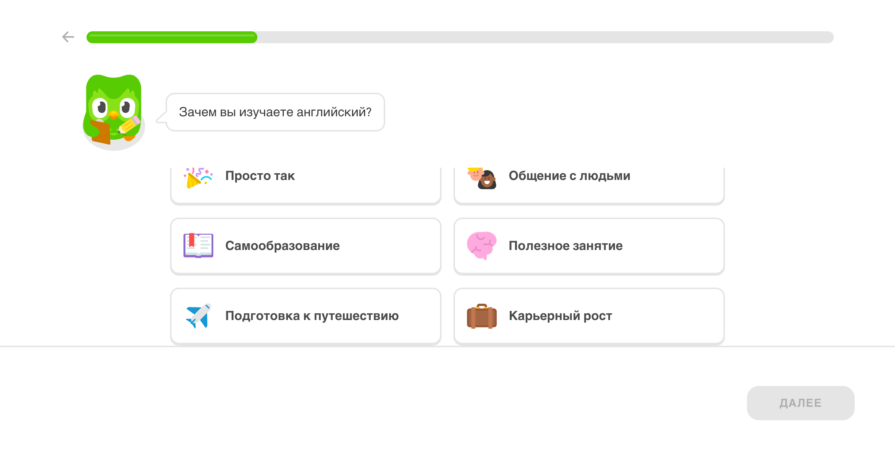
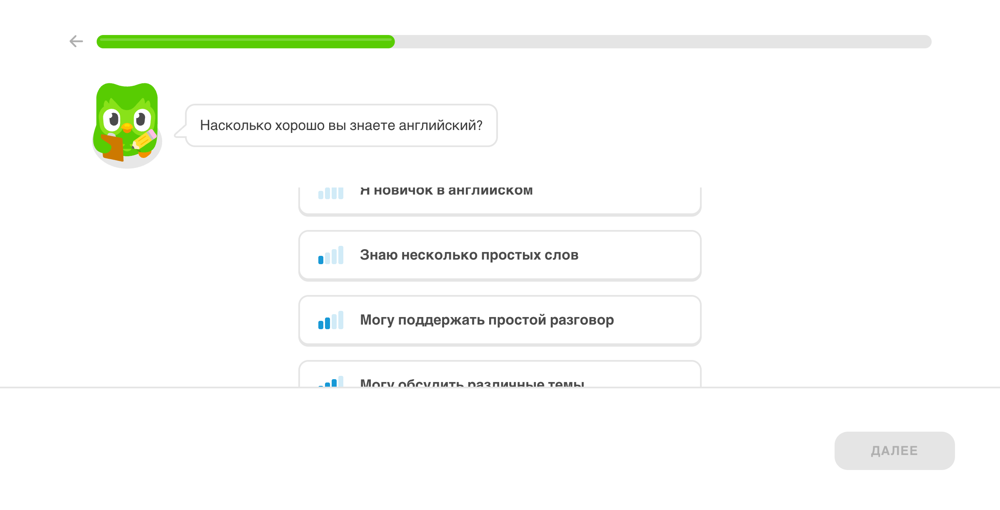
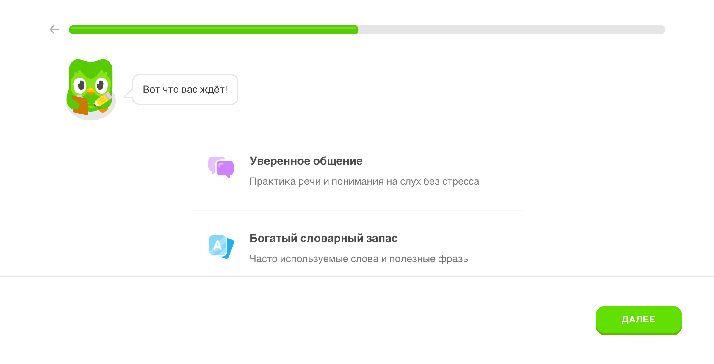
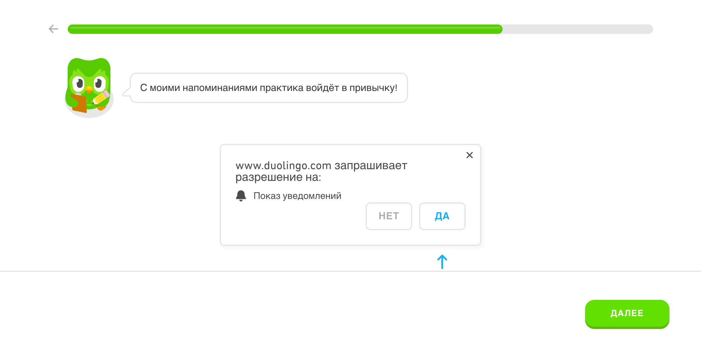
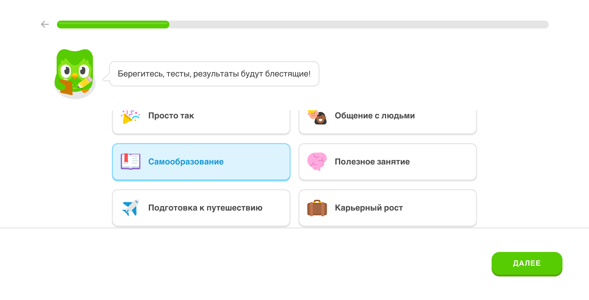

# ЖИВОЕ ИЗУЧЕНИЕ DUOLINGO: ДЕТАЛЬНОЕ ОПИСАНИЕ

## 📋 ОГЛАВЛЕНИЕ ДЛЯ АГЕНТОВ

**⚠️ ВАЖНО:** Все скриншоты встроены в документ! Смотрите визуально каждый экран.

**Читайте документ последовательно:**
1. **🧭 МЕНЮ И НАВИГАЦИЯ** - раздел ниже (7 пунктов меню) - **НАЧНИТЕ ЗДЕСЬ!**
2. **📱 ЭКРАНЫ ОНБОРДИНГА** - регистрация, выбор пути (с скриншотами)
3. **📚 УРОКИ** - все типы упражнений (8-9 типов) с скриншотами
4. **📱 РАЗДЕЛЫ ПРИЛОЖЕНИЯ** - все страницы меню с пометками 📱 (каждый раздел указывает пункт меню)
5. **🚀 ПЛАН РЕАЛИЗАЦИИ** - что за чем создавать (в конце документа, пронумеровано)

---

## 🧭 МЕНЮ И НАВИГАЦИЯ DUOLINGO (ОБЗОР)

**Верхняя панель навигации (7 пунктов):**

1. **📚 Обучение** (/learn) - главная страница с путем обучения
2. **🔤 Буквы** (/characters) - изучение произношения
3. **🏆 Рейтинги** (/leaderboard) - соревнование
4. **✅ Задания** (/quests) - ежедневные задания
5. **🛒 Магазин** (/shop) - покупка бонусов
6. **👤 Профиль** - профиль пользователя
7. **⋮ Ещё** - дополнительное меню

**Статистика в шапке (всегда видна):**
- ❤️ **5** (жизни/Hearts) - иконка сердца
- 🔥 **1** (стрик) - иконка огня (день подряд)
- ⭐ **505** (XP) - очки опыта
- 🎯 **5** (уровень) - текущий уровень

**Каждый раздел в документе помечен эмодзи 📱 и указано, какой пункт меню открывает этот раздел.**

**📸 Все скриншоты встроены прямо в документ** - агенты видят визуально каждый экран при чтении!

---

## МЕТОДОЛОГИЯ

Изучаю Duolingo в реальном времени через браузер, описывая каждый экран, каждую механику, каждый элемент интерфейса.

**Дата начала:** 2025-01-06  
**Статус:** ✅ Полное изучение завершено - все разделы изучены - готово к реализации

---

## ЭКРАН 1: ГЛАВНАЯ СТРАНИЦА

**🔗 URL:** `https://www.duolingo.com/`

**Элементы:**
- Логотип Duolingo (слева)
- Навигация: выбор языка сайта
- Заголовок: "Учите языки бесплатно, весело и эффективно!"
- Кнопки: "Начать" и "У меня уже есть аккаунт"
- Список языков для изучения (английский, испанский, французский, немецкий)

**Дизайн:**
- Минималистичный
- Зеленая цветовая схема (фирменный цвет Duolingo)
- Большие кнопки
- Чистый белый фон

**📸 Скриншот:** 

---

## ЭКРАН 2: ВЫБОР ЯЗЫКА ДЛЯ ИЗУЧЕНИЯ

**URL:** `https://www.duolingo.com/register`

**Элементы:**
- Заголовок: "Я хочу изучать..."
- Список языков в виде карточек:
  - Английский (17,3 млн учащихся)
  - Немецкий (3,02 млн учащихся)
  - Французский (1,93 млн учащихся)
  - Испанский (1,62 млн учащихся)
  - Итальянский (377 тыс. учащихся)
  - Китайский (376 тыс. учащихся)
  - Корейский (321 тыс. учащийся)
  - Японский (267 тыс. учащихся)
  - Португальский (44,7 тыс. учащихся)

**Дизайн:**
- Каждая карточка с флагом страны
- Показывает количество учащихся (социальное доказательство)
- Большие кликабельные области

**Выбрал:** Английский

---

## ЭКРАН 3: ОНБОРДИНГ - ПРИВЕТСТВИЕ

**URL:** `https://www.duolingo.com/welcome`

**Элементы:**
- **Duo (совенок)** - главный персонаж
  - Зеленый совенок с большими глазами
  - Держит планшет и карандаш
  - Анимация (появляется слева)
  
- **Сообщение от Duo:**
  - "Привет! Я Duo!"
  - "Ну что, поехали!"
  
- **Прогресс-бар** вверху
  - Зеленый заполненный сегмент слева
  - Светло-серый остальной путь
  - Показывает прогресс онбординга

- **Кнопка "Далее"** (справа внизу)
  - Зеленая, большая
  - Становится активной после действий

**Дизайн:**
- Duo всегда слева
- Речевой пузырь с текстом
- Минималистичный, фокус на Duo

---

## ЭКРАН 4: ОПРОС - КАК УЗНАЛИ О DUOLINGO

**Вопрос:** "Как вы узнали о Duolingo?"

**Варианты ответов (в виде карточек 2x3):**
1. "Из TikTok" - иконка конфетти
2. "Из новостей, статьи, блога" - иконка газеты
3. "Из видео на YouTube" - иконка YouTube
4. "Из Facebook/Instagram" - иконка соцсетей
5. "По телевидению" - иконка TV
6. "От друзей или родных" - иконка людей
7. "Из поиска в Google" - иконка поиска
8. "Другое" - иконка многоточия

**Дизайн:**
- Каждая карточка с иконкой
- При выборе - подсветка (светло-синий фон и рамка)
- Duo слева с сообщением: "Берегитесь, тесты, результаты будут блестящие!"

**Выбрал:** "От друзей или родных"

---

## ЭКРАН 5: ОПРОС - ЗАЧЕМ ИЗУЧАЕТЕ АНГЛИЙСКИЙ

**Вопрос:** "Зачем вы изучаете английский?"

**Варианты ответов:**
1. "Просто так" - иконка конфетти
2. "Общение с людьми" - иконка двух лиц
3. "Самообразование" - иконка открытой книги
4. "Полезное занятие" - иконка мозга (розовая)
5. "Подготовка к путешествию" - иконка самолета
6. "Карьерный рост" - иконка портфеля (коричневая)

**Дизайн:**
- Карточки 2x3
- При выборе - подсветка
- Duo слева с сообщением: "Берегитесь, тесты, результаты будут блестящие!"

**Выбрал:** "Самообразование"

---

## ЭКРАН 6: ОПРОС - УРОВЕНЬ ЗНАНИЙ

**Вопрос:** "Насколько хорошо вы знаете английский?"

**Варианты ответов (вертикальный список):**
1. "Я новичок в английском" - иконка графика (1 столбец)
2. "Знаю несколько простых слов" - иконка графика (2 столбца)
3. "Могу поддержать простой разговор" - иконка графика (3 столбца)
4. "Могу обсудить различные темы" - иконка графика (4 столбца)
5. "Могу подробно обсудить большинство тем" - иконка графика (5 столбцов)

**Дизайн:**
- Вертикальный список
- Каждый вариант с иконкой графика (показывает уровень)
- Duo слева с сообщением: "Тогда начнём с чистого листа!"

**Выбрал:** "Я новичок в английском"

---

## ЭКРАН 7: ОБЗОР КУРСА

**Заголовок:** "Вот что вас ждёт!"

**Три карточки с преимуществами:**

1. **"Уверенное общение"**
   - Иконка: микрофон/голос
   - Описание: "Практика речи и понимания на слух без стресса"

2. **"Богатый словарный запас"**
   - Иконка: словарь/книга
   - Описание: "Часто используемые слова и полезные фразы"

3. **"Привычка заниматься регулярно"**
   - Иконка: календарь/часы
   - Описание: "Умные напоминания, нескучные уроки и многое другое"

**Дизайн:**
- Три карточки в ряд
- Duo слева с сообщением: "Вот что вас ждёт!"
- Каждая карточка с иконкой и текстом

---

## ЭКРАН 8: ЕЖЕДНЕВНАЯ ЦЕЛЬ

**Вопрос:** "Какую цель поставим на день?"

**Варианты ответов:**
1. "5 минут в день" - Лёгкая
2. "10 минут в день" - Обычная
3. "15 минут в день" - Серьёзная
4. "20 минут в день" - Интенсивная

**Дизайн:**
- Вертикальный список
- Каждый вариант показывает время и сложность
- Duo слева с сообщением: "Значит, за первую неделю вы выучите 50 новых слов!"

**Выбрал:** "10 минут в день" (Обычная)

---

## ЭКРАН 9: РАЗРЕШЕНИЕ НА УВЕДОМЛЕНИЯ

**Сообщение от Duo:** "С моими напоминаниями практика войдёт в привычку!"

**Элементы:**
- Браузерный диалог разрешений
- "www.duolingo.com запрашивает разрешение на:"
- "Показ уведомлений"
- Кнопки: "НЕТ" и "ДА"

**Дизайн:**
- Duo слева
- Браузерный диалог в центре
- Кнопки внизу

**Выбрал:** "НЕТ" (чтобы продолжить быстрее)

---

## ЭКРАН 10: ВЫБОР ПУТИ ОБУЧЕНИЯ

**Вопрос:** "А теперь давайте решим, по какому пути пойдём!"

**Варианты:**
1. **"Начать с основ"**
   - Описание: "Пройдите вводный урок из курса английского"
   - Иконка: книга/учебник

2. **"Определить мой уровень"**
   - Описание: "Duo посоветует, с чего лучше начать"
   - Иконка: тест/график

**Дизайн:**
- Две большие карточки
- При выборе - подсветка
- Duo слева с сообщением: "А теперь давайте решим, по какому пути пойдём!"

**Выбрал:** "Начать с основ"

**📸 Скриншот:** 

---

## ЭКРАН 11: МОТИВАЦИОННОЕ СООБЩЕНИЕ

**Сообщение от Duo:** "Сохранять мотивацию бывает нелегко..."

**Элементы:**
- Duo слева
- Прогресс-бар вверху (почти завершен)
- Кнопка "Далее" активна

**Назначение:** Подготовка к первому уроку, мотивация

---

## ЭКРАН 12: ПЕРВЫЙ РЕАЛЬНЫЙ УРОК - УПРАЖНЕНИЕ 1

**URL:** `https://www.duolingo.com/lesson`

**СТРУКТУРА ЭКРАНА:**

### Header (Верхняя панель):
- **Кнопка "Назад"** (слева) - стрелка влево
- **Прогресс-бар** (центр) - показывает прогресс урока
  - Зеленый заполненный сегмент слева
  - Серый остальной путь
- **Hearts (Жизни)** (справа) - показывает "5" с иконкой сердца
  - Это система жизней: 5 сердец = можно сделать 5 ошибок

### Основной контент:

**Тип упражнения:** "Новое слово"

**Вопрос:** "Выберите слово «кофе»"

**Варианты ответов (3 кнопки):**
1. **"butter"** - масло (номер 1)
2. **"coffee"** - кофе (номер 2) ✅ ПРАВИЛЬНЫЙ
3. **"tea"** - чай (номер 3)

**Дизайн вариантов:**
- Большие кнопки
- Текст слова по центру
- Номер в углу (1, 2, 3)
- При наведении - подсветка

### Нижняя панель:
- **Кнопка "Пропустить"** (слева) - серая
- **Кнопка "Проверить"** (справа) - зеленая, но **disabled** пока не выбран ответ

**📸 Скриншот:** 

**Выбрал:** "coffee" (правильный ответ)

---

## ЭКРАН 13: ОБРАТНАЯ СВЯЗЬ - ПРАВИЛЬНЫЙ ОТВЕТ

**После нажатия "Проверить":**

### Что происходит:

1. **Все варианты становятся disabled** (нельзя изменить выбор)

2. **Появляется обратная связь:**
   - Заголовок: **"Отлично!"** (зеленый, крупный)
   - Кнопка "Сообщить о проблеме" (маленькая, справа)

3. **Кнопка "Далее"** появляется внизу (зеленая, большая)

4. **Всплывающее окно объяснения Hearts:**
   - Показывает 5 сердец (иконки)
   - Заголовок: **"Каждая ошибка стоит 1 жизнь!"**
   - Текст: "Соберитесь и будьте внимательны, чтобы не терять жизни. Вы справитесь!"
   - Кнопка "Продолжить"

**Скриншот обратной связи:** 

**Важные наблюдения:**
- Нет автоматического перехода - нужно нажать "Далее"
- Hearts объясняются в первый раз
- Позитивная мотивация даже при объяснении системы ошибок

---

## ЭКРАН 14: УПРАЖНЕНИЕ 2 - ОБРАТНЫЙ ПЕРЕВОД

**Тип упражнения:** "Новое слово" (тот же тип, но обратное направление)

**Вопрос:** "Выберите верный вариант"

**Формат:**
- Показывается слово **"кофе"** (на русском) с иконкой
- Нужно выбрать правильный перевод на английском

**Варианты ответов (3 кнопки):**
1. **"please"** - пожалуйста (номер 1)
2. **"tea"** - чай (номер 2)
3. **"coffee"** - кофе (номер 3) ✅ ПРАВИЛЬНЫЙ

**Дизайн:**
- Слово "кофе" показано крупно с иконкой
- Варианты ответов внизу
- Та же структура: номер + слово

**Прогресс-бар:** Обновился, показывает прогресс урока

**Hearts:** Все еще 5

**Скриншот:** 

**Выбрал:** "coffee" (правильный ответ)

**После проверки:**
- Заголовок: **"Супер!"** (вместо "Отлично!" - разные сообщения)
- В прогресс-баре появился текст: **"2 верных ответа подряд"**
- Это система **streak** (серии правильных ответов)
- Hearts: все еще 5

**Скриншот обратной связи:** 

---

## ЭКРАН 15: УПРАЖНЕНИЕ 3 - НОВОЕ СЛОВО "ЧАЙ"

**Тип упражнения:** "Новое слово"

**Вопрос:** "Выберите слово «чай»"

**Варианты ответов (3 кнопки):**
1. **"milk"** - молоко (номер 1)
2. **"coffee"** - кофе (номер 2)
3. **"tea"** - чай (номер 3) ✅ ПРАВИЛЬНЫЙ

**Структура:** Та же, что и в упражнении 1

**Скриншот:** 

**Выбрал:** "tea" (правильный ответ)

**После проверки:**
- Заголовок: **"Потрясающе!"** (третье сообщение - разные для каждого ответа)
- В прогресс-баре: **"3 верных ответа подряд"**
- Hearts: все еще 5

**Скриншот обратной связи:** 

**Наблюдение:** Сообщения меняются: "Отлично!" → "Супер!" → "Потрясающе!" - это мотивирует продолжать

---

## ЭКРАН 16: УПРАЖНЕНИЕ 4 - ОБРАТНЫЙ ПЕРЕВОД "ЧАЙ"

**Тип упражнения:** "Новое слово" (обратный перевод)

**Вопрос:** "Выберите верный вариант"

**Формат:**
- Показывается слово **"чай"** (на русском) с иконкой
- Нужно выбрать правильный перевод на английском

**Варианты ответов (3 кнопки):**
1. **"tea"** - чай (номер 1) ✅ ПРАВИЛЬНЫЙ
2. **"please"** - пожалуйста (номер 2)
3. **"coffee"** - кофе (номер 3)

**Скриншот:** 

**Выбрал:** "tea" (правильный ответ)

**После проверки:**
- Заголовок: **"Здорово!"** (четвертое сообщение)
- В прогресс-баре: **"4 верных ответа подряд"**
- Hearts: все еще 5

**Наблюдение:** Сообщения продолжают меняться - это создает разнообразие и мотивацию

---

## ЭКРАН 17: УПРАЖНЕНИЕ 5 - НОВЫЙ ТИП: СОСТАВЛЕНИЕ ПРЕДЛОЖЕНИЯ

**Тип упражнения:** "Новое слово" - **НОВЫЙ ФОРМАТ!**

**Вопрос:** "Напишите на русском"

**Формат упражнения:**
- Показывается английское слово **"please"** (пожалуйста)
- Внизу поле для ввода (показывает "please")
- Ниже кнопки с русскими словами для выбора:
  1. **"кофе"** (активная)
  2. **"пожалуйста"** ✅ ПРАВИЛЬНЫЙ
  3. **"здравствуйте"**
  4. **"хлеб"**
  5. **"спасибо"**

**Механика:**
- Нужно выбрать правильный перевод из кнопок
- Кнопки кликабельные
- Можно удалить слово (кнопка с крестиком)

**Подсказка внизу:** "Не забывайте наводить курсор на новые слова, чтобы уточнить их значение."

**Скриншот:** 

**Выбрал:** "пожалуйста" (правильный ответ)

**Важное наблюдение:** Это другой тип упражнения - не просто выбор, а составление перевода из доступных слов

**Фидбек:** "Превосходно!" + прогресс "5 верных ответов подряд" в прогресс-баре

**Скриншот фидбека:** 

**Переход к следующему упражнению...**

---

## ЭКРАН 18: МОТИВАЦИОННОЕ СООБЩЕНИЕ (ПРОМЕЖУТОЧНЫЙ)

**Тип:** Промежуточный экран между упражнениями

**Содержание:**
- Изображение Duo (персонаж)
- Текст: **"Отлично! Вы усердно занимаетесь и учите новые слова!"**

**Механика:**
- Появляется после нескольких правильных ответов
- Мотивирует продолжать
- Кнопка "Далее" для продолжения

**Важно для нас:** Психолог Катя может давать такие промежуточные поощрения после успешных упражнений по личным границам

**Скриншот:** 

**Переход к следующему упражнению...**

---

## ЭКРАН 19: УПРАЖНЕНИЕ 6 - ВЫБОР ИЗ ВАРИАНТОВ (RADIO BUTTONS)

**Тип упражнения:** "Выберите верный вариант"

**Формат:**
- Показывается русское слово **"пожалуйста"** с иконкой
- Вопрос: "Выберите верный вариант"
- **3 варианта с радио-кнопками:**
  1. **"please"** ✅ ПРАВИЛЬНЫЙ (уже выбран)
  2. "coffee"
  3. "hello"

**Механика:**
- Радио-кнопки (можно выбрать только один вариант)
- Кнопка "Проверить" активируется после выбора
- Кнопка "Пропустить" доступна

**Важно для нас:** Этот формат идеален для вопросов типа "Какая это граница?" с вариантами: физическая, эмоциональная, временная, цифровая

**Скриншот:** 

**Выбрал:** "please" (правильный ответ)

**Фидбек:** "Супер!" + прогресс "6 верных ответов подряд" в прогресс-баре

**Скриншот фидбека:** 

**Продолжаю прохождение...**

---

## ЭКРАН 20: УПРАЖНЕНИЕ 7 - СОСТАВЛЕНИЕ ПРЕДЛОЖЕНИЯ ИЗ СЛОВ

**Тип упражнения:** "Напишите на русском" - **СОСТАВЛЕНИЕ ПРЕДЛОЖЕНИЯ**

**Формат:**
- Показывается английское предложение: **"Coffee, please."**
- Вопрос: "Напишите на русском"
- Поле для ввода (пока пустое или с начальным словом)
- **6 кнопок со словами для выбора:**
  1. "соль" (уже выбрано - неправильно)
  2. "масло"
  3. "или"
  4. **"пожалуйста"** ✅ НУЖНО
  5. "хлеб"
  6. **"Кофе"** ✅ НУЖНО

**Механика:**
- Нужно составить предложение из доступных слов
- Слова можно выбирать кликом
- Можно удалять слова (кнопка с крестиком)
- Кнопка "Проверить" активируется когда выбраны слова

**Важно для нас:** ИДЕАЛЬНО для обучения формулировкам установления границ! Например: "Мне нужно время подумать" из слов: "Мне", "нужно", "время", "подумать"

**Скриншот:** 

**Правильный ответ:** "Кофе, пожалуйста."

**Фидбек:** "Верно!" + прогресс "7 верных ответов подряд" в прогресс-баре

**Скриншот фидбека:** 

**Продолжаю прохождение...**

---

---

## РЕЗЮМЕ: ТИПЫ УПРАЖНЕНИЙ ДЛЯ НАШЕГО ПРОЕКТА

### 1. MULTIPLE CHOICE (Выбор из 3 вариантов)
**Формат:** Вопрос + 3 кнопки с вариантами ответов  
**Для нас:** "Какая это граница?" → Физическая / Эмоциональная / Временная / Цифровая

### 2. RADIO BUTTONS (Выбор одного варианта)
**Формат:** Вопрос + радио-кнопки (только один выбор)  
**Для нас:** "Как правильно установить границу?" → Варианты ответов

### 3. СОСТАВЛЕНИЕ ПЕРЕВОДА (Одно слово)
**Формат:** Показано слово на одном языке + кнопки со словами для выбора перевода  
**Для нас:** Показать ситуацию + выбрать правильную формулировку границы

### 4. СОСТАВЛЕНИЕ ПРЕДЛОЖЕНИЯ (Несколько слов)
**Формат:** Показано предложение + кнопки со словами для составления перевода  
**Для нас:** ИДЕАЛЬНО! Показать ситуацию + составить фразу установления границы из слов: "Мне", "нужно", "время", "подумать"

### 5. МОТИВАЦИОННЫЕ СООБЩЕНИЯ
**Формат:** Промежуточные экраны с персонажем (Duo) и поощрением  
**Для нас:** Психолог Катя дает поощрения после успешных упражнений

### 6. ПРОГРЕСС И СТРИКИ
**Формат:** Прогресс-бар с количеством верных ответов подряд  
**Для нас:** Отслеживание прогресса в изучении границ

### 7. СИСТЕМА ЖИЗНЕЙ (HEARTS)
**Формат:** 5 жизней, теряются при ошибках  
**Для нас:** Можно адаптировать как "энергия" или "уверенность"

### 8. АУДИО УПРАЖНЕНИЕ (Что вы услышали?)
**Формат:** Кнопка воспроизведения аудио + выбор из вариантов ответов  
**Для нас:** ИДЕАЛЬНО для ролевых игр! Воспроизвести ситуацию (аудио) + выбрать правильную реакцию/установление границы

### 9. СЛОЖНОЕ ЗАДАНИЕ (Напишите на английском)
**Формат:** Обратный перевод - показано на русском, нужно составить на английском из слов  
**Для нас:** Усложненная версия составления предложения - для продвинутых упражнений

---

## ИТОГОВОЕ РЕЗЮМЕ ДЛЯ РЕАЛИЗАЦИИ

**Собрано 8-9 типов упражнений:**
1. Multiple Choice (3 варианта)
2. Radio Buttons (выбор одного)
3. Составление перевода (одно слово)
4. Составление предложения (несколько слов)
5. Мотивационные сообщения от персонажа
6. Прогресс и стрики
7. Система жизней (Hearts)
8. Аудио упражнения
9. Сложные задания

**Ключевые механики:**
- Прогресс-бар с количеством верных ответов подряд
- 5 жизней (Hearts) - теряются при ошибках
- Разнообразные фидбеки: "Отлично!", "Супер!", "Превосходно!", "Верно!", "Здорово!"
- Промежуточные мотивационные сообщения от персонажа
- Кнопка "Пропустить" всегда доступна
- Кнопка "Проверить" активируется после выбора ответа
- Дополнительная информация после правильного ответа (например, "Значение: ...")

**Готово к реализации!**

---

## ЭКРАН ЗАВЕРШЕНИЯ УРОКА

**Прогресс:** 100% (15 верных ответов подряд)

**Типы упражнений, которые встретились в первом уроке:**
1. Multiple Choice (выбор из 3 вариантов) - "coffee", "tea", "hello"
2. Составление перевода (одно слово) - "please" из кнопок
3. Radio Buttons (выбор одного варианта) - "Выберите верный вариант"
4. Составление предложения (несколько слов) - "Coffee, please." из слов
5. Аудио упражнение - "Что вы услышали?" + выбор ответа
6. Сложное задание - обратный перевод "Напишите на английском"

**Всего упражнений в уроке:** ~15
**Всего типов упражнений найдено:** 8-9

**📸 Скриншот завершения урока:** 

**Экран завершения урока:**
- Заголовок: "Конец урока!"
- Изображение Duo (персонаж)
- **Очки опыта (XP)** - показывается количество заработанных очков
- **Оценка:** "Здорово" + процент правильных ответов
- Кнопки: "Обзор урока" и "Далее"

**Важно для нас:** После завершения урока показывать:
- Заработанные XP
- Оценку от психолога Кати
- Прогресс по модулю
- Кнопку "Продолжить обучение"

---

---

## 📱 РАЗДЕЛ: ГЛАВНАЯ СТРАНИЦА ОБУЧЕНИЯ (/learn)

**🔗 URL:** `https://www.duolingo.com/learn`

### 🧭 МЕНЮ И НАВИГАЦИЯ (верхняя панель):

**7 пунктов меню:**
1. **📚 Обучение** (/learn) - главная страница с путем обучения ⭐ **ТЕКУЩИЙ РАЗДЕЛ**
2. **🔤 Буквы** (/characters) - изучение персонажей
3. **🏆 Рейтинги** (/leaderboard) - таблица лидеров
4. **✅ Задания** (/quests) - ежедневные задания
5. **🛒 Магазин** (/shop) - магазин с бонусами
6. **👤 Профиль** - профиль пользователя
7. **⋮ Ещё** - дополнительное меню

**Статистика в шапке:**
- **5** (жизни/Hearts) - иконка сердца
- **1** (стрик) - иконка огня (день подряд)
- **505** (XP) - очки опыта
- **5** (уровень) - текущий уровень

**Блоки на странице:**

### 1. РЕЙТИНГИ (блок)
- Заголовок: "Откройте рейтинги!"
- Текст: "Пройдите ещё 9 уроков, чтобы вступить в состязание"
- **Для нас:** Можно добавить соревнование между подростками в изучении границ

### 2. ЗАДАНИЯ ДНЯ (Daily Quests)
- Заголовок: "Задания дня"
- Кнопка "Все" (переход к /quests)
- Пример задания: "Получите 10 очков опыта"
- Прогресс-бар: 10 / 10 (выполнено)
- Иконка галочки (задание выполнено)
- **Для нас:** Ежедневные задания по личным границам - "Установи границу сегодня", "Пройди 3 упражнения"

### 3. ПУТЬ ОБУЧЕНИЯ (Learning Path)
- **Модули** - большие разделы (Модуль 1, Модуль 2...)
- **Разделы** внутри модулей (Раздел 1, Раздел 2...)
- **Уроки** внутри разделов (Lesson 1 of 4, Lesson 2 of 4...)
- Кнопки для каждого урока:
  - **Lesson** - основной урок
  - **Сундук** - награда (заблокирован до прохождения)
  - **Practice** - практика/повторение
  - **Обзор раздела** - обзор пройденного материала
- **Справочник** - кнопка для каждого раздела
- **Переход к разделу** - тест для перехода к следующему разделу

**Важно для нас:** 
- Путь обучения = наш LearningPath компонент
- Модули = наши 12 модулей + модуль "Личные границы"
- Разделы = уроки внутри модулей
- Practice = повторение пройденного материала
- Сундук = награды за прохождение разделов

**📸 Скриншот:** 

**Изучаю другие разделы...**

---

---

## 📱 РАЗДЕЛ: СТРАНИЦА ЗАДАНИЙ (/quests)

**🔗 URL:** `https://www.duolingo.com/quests`  
**🧭 МЕНЮ:** Пункт 4 "✅ Задания" в верхней навигации

**Элементы:**

### 1. МАРАФОНЫ (блок)
- Заголовок: "Скоро будут доступны марафоны!"
- Текст: "Выполняйте задание каждого месяца и получайте эксклюзивные медали!"
- Изображение
- Кнопка "НАЧАТЬ УРОК" (переход к /practice)
- **Для нас:** Месячные челленджи по личным границам с наградами

### 2. ЗАДАНИЯ ДНЯ
- Заголовок: "Задания дня"
- Таймер: "2 часа" (время до обновления)
- Пример задания: "Получите 10 очков опыта"
- Прогресс-бар: 10 / 10 (выполнено)
- Иконка галочки (задание выполнено)
- Текст: "Скоро будет доступно ещё больше заданий"

**Важно для нас:** 
- Ежедневные задания = наш WeeklyChallenges компонент
- Марафоны = долгосрочные челленджи
- Таймеры создают срочность

**📸 Скриншот:** 

---

---

## 📱 РАЗДЕЛ: СТРАНИЦА МАГАЗИНА (/shop)

**🔗 URL:** `https://www.duolingo.com/shop`  
**🧭 МЕНЮ:** Пункт 5 "🛒 Магазин" в верхней навигации

**Валюта:** Алмазы (Gems)
- Текст: "Вы заработали 505 алмазов! Создайте профиль, чтобы потратить их в магазине."

**Категории товаров:**

### 1. ЖИЗНИ
- **Товар:** Жизни за алмазы
- **Описание:** "Восстановите максимум жизней и не переживайте из-за допущенных ошибок."
- **Статус:** "Не требуется" (кнопка заблокирована)

### 2. УСИЛЕНИЯ (Power-ups)
- **Товар:** Заморозка
- **Статус:** "Активно: 2/2"
- **Описание:** "Заранее купленная заморозка позволит сохранить ударный режим, если вы вдруг пропустите один день занятий."

**Важно для нас:**
- Валюта (алмазы) = наши XP или специальная валюта
- Магазин для покупки бонусов, восстановления энергии, усилений
- Заморозка стрика = защита от потери прогресса

**📸 Скриншот:** 

---

---

## 📱 РАЗДЕЛ: СТРАНИЦА БУКВ/ПРОИЗНОШЕНИЯ (/characters)

**🔗 URL:** `https://www.duolingo.com/characters`  
**🧭 МЕНЮ:** Пункт 2 "🔤 Буквы" в верхней навигации

**Назначение:** Изучение звуков и произношения

**Структура:**

### 1. ВВОДНЫЙ БЛОК
- Заголовок: "Давайте изучать звуки в английском языке!"
- Описание: "Тренируйте понимание на слух и учитесь произносить звуки"
- Кнопка: "НАЧАТЬ: +10 опыта" (переход к /alphabets/en/pronunciation)

### 2. ГЛАСНЫЕ (Vowels) - 15 звуков
Каждый звук: символ, пример слова, прогресс-бар (0%)

### 3. СОГЛАСНЫЕ (Consonants) - 24 звука
Каждый звук: символ, пример слова, прогресс-бар (0%)

**Важно для нас:**
- Дополнительный раздел для углубленного изучения
- Прогресс по каждому элементу
- Можно адаптировать для изучения типов границ, техник установления границ

**📸 Скриншот:** 

---

---

## 📱 РАЗДЕЛ: СТРАНИЦА РЕЙТИНГОВ (/leaderboard)

**🔗 URL:** `https://www.duolingo.com/leaderboard`  
**🧭 МЕНЮ:** Пункт 3 "🏆 Рейтинги" в верхней навигации

**Назначение:** Соревнование между пользователями

**Структура:**

### 1. ОПИСАНИЕ
- Заголовок: "ЧТО ТАКОЕ РЕЙТИНГ?"
- Текст: "Учитесь. Зарабатывайте опыт. Соревнуйтесь."
- Описание: "Попробуйте занять новую позицию в недельном рейтинге, набрав как можно больше очков опыта за уроки"

### 2. БЛОКИРОВКА
- Заголовок: "Откройте рейтинги!"
- Текст: "Пройдите ещё 9 уроков, чтобы вступить в состязание"
- Кнопка: "НАЧАТЬ УРОК" (переход к /practice)

**Важно для нас:**
- Недельные рейтинги по XP
- Мотивация через соревнование
- Порог входа (9 уроков) - защита от спама
- Можно сделать рейтинги по модулям, по установленным границам

**📸 Скриншот:** 

---

---

## 📱 РАЗДЕЛ: МЕНЮ "ЕЩЁ"

**🧭 МЕНЮ:** Пункт 7 "⋮ Ещё" в верхней навигации (выпадающее меню)

**Пункты меню:**
1. **Duolingo English Test** - внешняя ссылка
2. **Schools** - внешняя ссылка
3. **Создать аккаунт** - регистрация
4. **Настройки** - настройки приложения
5. **Справка** - помощь
6. **Войти** - авторизация

**Футер (нижняя часть страницы):**
- О Duolingo (/info)
- Магазин (внешняя ссылка)
- Эффективность (/efficacy)
- Вакансии (внешняя ссылка)
- ИНВЕСТОРЫ (внешняя ссылка)
- Условия (/terms)
- Конфиденциальность (/privacy)

---

## НАБЛЮДЕНИЯ ПО ДИЗАЙНУ

### Цветовая схема:
- **Зеленый** - основной цвет (кнопки, прогресс)
- **Белый** - фон
- **Серый** - неактивные элементы
- **Синий** - выделение выбранных элементов

### Типографика:
- Крупный текст для вопросов
- Средний текст для описаний
- Жирный шрифт для акцентов

### Анимации:
- Duo появляется плавно
- Прогресс-бар заполняется
- Карточки подсвечиваются при выборе

### UX принципы:
- Минимум кликов до начала
- Большие кликабельные области
- Понятная навигация (кнопка "Назад")
- Прогресс всегда виден (прогресс-бар)

---

---

## ПОЛНАЯ СТРУКТУРА ПРИЛОЖЕНИЯ DUOLINGO

### НАВИГАЦИЯ (верхняя панель):
1. **Обучение** (/learn) - главная страница с путем обучения
2. **Буквы** (/characters) - изучение произношения
3. **Рейтинги** (/leaderboard) - соревнование
4. **Задания** (/quests) - ежедневные задания
5. **Магазин** (/shop) - покупка бонусов
6. **Профиль** - профиль пользователя
7. **Ещё** - дополнительное меню

### СТАТИСТИКА В ШАПКЕ (всегда видна):
- **5** (жизни/Hearts) - иконка сердца
- **1** (стрик) - иконка огня (день подряд)
- **505** (XP) - очки опыта
- **5** (уровень) - текущий уровень

### ОСНОВНЫЕ РАЗДЕЛЫ:

#### 1. ОБУЧЕНИЕ (/learn)
- Путь обучения (Learning Path)
- Модули → Разделы → Уроки
- Кнопки: Lesson, Practice, Сундук, Обзор раздела
- Справочники разделов
- Задания дня (виджет)
- Рейтинги (виджет)

#### 2. УРОКИ (/lesson)
- 8-9 типов упражнений
- Прогресс-бар
- Система жизней
- Мотивационные сообщения
- Экран завершения с XP и оценкой

#### 3. ЗАДАНИЯ (/quests)
- Ежедневные задания с таймерами
- Марафоны (месячные челленджи)
- Прогресс-бары выполнения

#### 4. МАГАЗИН (/shop)
- Валюта: алмазы
- Покупка жизней
- Усиления (заморозка стрика)

#### 5. БУКВЫ (/characters)
- Изучение звуков
- Гласные и согласные
- Прогресс по каждому звуку

#### 6. РЕЙТИНГИ (/leaderboard)
- Недельные соревнования
- Порог входа (9 уроков)

---

## СООТНЕСЕНИЕ С НАШИМ ПРОЕКТОМ DA TEENS

### ЧТО У НАС УЖЕ ЕСТЬ:
✅ **LearningPath** - путь обучения (аналог /learn)
✅ **CastleGame** - визуализация прогресса
✅ **RolePlayScenarios** - ролевые упражнения
✅ **SleepMeditationHub** - сон и медитации
✅ **WeeklyChallenges** - еженедельные челленджи
✅ **SkillsTree** - дерево навыков
✅ **12 модулей + модуль "Личные границы"** - структура обучения
✅ **Адаптивная система** - учет эмоций, когнитивной нагрузки

### ЧТО НУЖНО ДОБАВИТЬ/ПЕРЕДЕЛАТЬ:

#### 1. ИГРОВОЙ РЕЖИМ УРОКОВ
- ❌ Сейчас: текстовые уроки (скучно для подростков)
- ✅ Нужно: Duolingo-like упражнения (8-9 типов)
- ✅ Персонаж Катя вместо Duo
- ✅ Система жизней (5 жизней)
- ✅ Прогресс-бар с верными ответами подряд
- ✅ Мотивационные сообщения от Кати

#### 2. НАВИГАЦИЯ
- ❌ Сейчас: нет единой навигации
- ✅ Нужно: верхняя панель как в Duolingo
  - Обучение (главная)
  - Задания (WeeklyChallenges)
  - Магазин (опционально)
  - Профиль
  - Сон/Медитации (всегда доступны)

#### 3. СТАТИСТИКА В ШАПКЕ
- ❌ Сейчас: нет
- ✅ Нужно: Hearts, Streak, XP, Level (всегда видно)

#### 4. СТРАНИЦА ЗАДАНИЙ
- ✅ Есть WeeklyChallenges, но нужно:
  - Ежедневные задания с таймерами
  - Марафоны (месячные челленджи)
  - Прогресс-бары

#### 5. ЭКРАН ЗАВЕРШЕНИЯ УРОКА
- ❌ Сейчас: просто переход дальше
- ✅ Нужно: XP, оценка от Кати, прогресс, кнопка "Продолжить"

---

## ПЕРСОНАЖИ И ГЕРОИ: КАК ДЕЛАТЬ

### DUOLINGO: Duo (совенок)
**Техническая реализация:**
- **2D иллюстрации** (SVG/PNG)
- **Анимации:** появление, реакции (радость, грусть, мотивация)
- **Позиционирование:** всегда виден, комментирует действия
- **Эмоции:** разные состояния (радостный, грустный, мотивирующий)

### НАШ ПРОЕКТ: Психолог Катя

#### ВАРИАНТ 1: 2D ИЛЛЮСТРАЦИИ (РЕКОМЕНДУЕТСЯ)
**Технологии:**
- **SVG иллюстрации** - векторная графика, масштабируется
- **Framer Motion** - анимации (у нас уже есть)
- **React компонент** - `KatyaCharacter.tsx`

**Что нужно:**
1. **Дизайнер** - создать иллюстрации Кати в разных состояниях:
   - Нейтральная (обычная)
   - Радостная (правильный ответ)
   - Поддерживающая (ошибка)
   - Мотивирующая (промежуточные экраны)
   - Празднующая (завершение урока)

2. **Анимации:**
   - Появление (fade in)
   - Покачивание головой (nod)
   - Руки вверх (celebration)
   - Подмигивание (wink)
   - Жесты поддержки

3. **Реализация:**
```tsx
// Пример структуры
<KatyaCharacter 
  emotion="happy" // happy, sad, neutral, celebrating, supporting
  animation="nod" // nod, wave, celebrate, wink
  message="Отлично! Ты правильно установил границу!"
/>
```

**Плюсы:**
- ✅ Легко реализовать
- ✅ Быстро загружается
- ✅ Адаптивно (работает на всех устройствах)
- ✅ Можно использовать Framer Motion (уже в проекте)

**Минусы:**
- ⚠️ Нужен дизайнер для создания иллюстраций
- ⚠️ Меньше "живости" чем 3D

#### ВАРИАНТ 2: 3D МОДЕЛЬ
**Технологии:**
- **Three.js** или **React Three Fiber**
- **3D модель** (GLTF/GLB)
- **Анимации** (Blender)

**Плюсы:**
- ✅ Очень реалистично
- ✅ Можно вращать, приближать
- ✅ Больше интерактивности

**Минусы:**
- ❌ Сложнее реализовать
- ❌ Больше размер файлов
- ❌ Нужен 3D дизайнер
- ❌ Может быть медленнее на слабых устройствах

#### ВАРИАНТ 3: АНИМАЦИОННЫЕ GIF/VIDEO
**Технологии:**
- **GIF анимации** или **MP4 видео**
- **Lottie** (JSON анимации)

**Плюсы:**
- ✅ Легко добавить
- ✅ Можно использовать готовые анимации

**Минусы:**
- ❌ Меньше гибкости
- ❌ Больше размер файлов
- ❌ Сложнее адаптировать под разные состояния

### РЕКОМЕНДАЦИЯ ДЛЯ НАШЕГО ПРОЕКТА:

**✅ ВАРИАНТ 1: 2D ИЛЛЮСТРАЦИИ + FRAMER MOTION**

**Почему:**
1. У нас уже есть Framer Motion в проекте
2. Легко интегрировать
3. Быстро работает
4. Адаптивно
5. Можно сделать красиво и современно

**План реализации:**

1. **Дизайн (нужен дизайнер):**
   - Создать иллюстрации Кати в 5-7 состояниях
   - Стиль: дружелюбный, современный, подходит подросткам
   - Формат: SVG (вектор) или PNG (высокое качество)

2. **Компонент (разработка):**
   ```tsx
   // src/components/game/KatyaCharacter.tsx
   - Props: emotion, animation, message, position
   - Использовать Framer Motion для анимаций
   - Поддержка разных размеров (маленький в углу, большой на экране)
   ```

3. **Интеграция:**
   - В каждый экран урока
   - Мотивационные сообщения
   - Реакции на правильные/неправильные ответы
   - Экран завершения урока

**Можем ли мы сделать таких героев?**
- ✅ **ДА, ТЕХНИЧЕСКИ** - у нас есть все технологии
- ⚠️ **НО НУЖЕН ДИЗАЙНЕР** - для создания иллюстраций Кати
- ✅ **АНИМАЦИИ** - можем сделать сами через Framer Motion
- ✅ **ИНТЕГРАЦИЯ** - можем сделать сами

**Альтернатива (если нет дизайнера):**
- Использовать готовые иллюстрации (например, из библиотек)
- Или начать с простых иконок/эмодзи, потом улучшить
- Или использовать AI для генерации иллюстраций

---

## ОПТИМИЗАЦИЯ АНИМАЦИЙ: КАК НЕ ТОРМОЗИТЬ ПРИЛОЖЕНИЕ

### ПРОБЛЕМА: АНИМАЦИИ МОГУТ ТОРМОЗИТЬ

**Риски:**
- ❌ Сложные анимации = низкий FPS
- ❌ Большие файлы = медленная загрузка
- ❌ Много анимаций одновременно = лаги
- ❌ На слабых устройствах = зависания

### РЕШЕНИЕ: ОПТИМИЗИРОВАННЫЕ АНИМАЦИИ

#### 1. ИСПОЛЬЗОВАТЬ CSS АНИМАЦИИ (САМЫЕ БЫСТРЫЕ)
**Вместо JavaScript анимаций:**
```css
/* ✅ ХОРОШО - использует GPU */
.katya-enter {
  animation: fadeIn 0.3s ease-out;
  will-change: opacity; /* подсказка браузеру */
}

@keyframes fadeIn {
  from { opacity: 0; }
  to { opacity: 1; }
}

/* ✅ ХОРОШО - transform использует GPU */
.katya-nod {
  animation: nod 0.5s ease-in-out;
  transform: translateZ(0); /* включить GPU */
}

@keyframes nod {
  0%, 100% { transform: translateY(0) translateZ(0); }
  50% { transform: translateY(-10px) translateZ(0); }
}
```

**Плюсы:**
- ✅ Работает на GPU (быстро)
- ✅ Не блокирует основной поток
- ✅ Низкое потребление ресурсов

#### 2. FRAMER MOTION С ОПТИМИЗАЦИЕЙ
**Правильное использование:**
```tsx
// ✅ ХОРОШО - используем layoutId и оптимизацию
<motion.div
  layoutId="katya"
  initial={{ opacity: 0 }}
  animate={{ opacity: 1 }}
  transition={{ duration: 0.3, ease: "easeOut" }}
  style={{ willChange: "opacity" }} // подсказка браузеру
>
  <KatyaImage />
</motion.div>

// ❌ ПЛОХО - сложные анимации каждый кадр
<motion.div
  animate={{ 
    x: [0, 100, 0], // сложная анимация
    y: [0, 50, 0],
    rotate: [0, 360, 0]
  }}
  transition={{ duration: 2, repeat: Infinity }}
>
```

**Рекомендации:**
- ✅ Использовать `layoutId` для плавных переходов
- ✅ Анимировать только `opacity`, `transform` (GPU)
- ✅ Избегать анимации `width`, `height`, `top`, `left` (медленно)
- ✅ Использовать `will-change` для подсказки браузеру
- ✅ Ограничить количество одновременных анимаций

#### 3. ЛЕНИВАЯ ЗАГРУЗКА ИЗОБРАЖЕНИЙ
```tsx
// ✅ ХОРОШО - загружаем только нужное
const KatyaCharacter = ({ emotion }: { emotion: string }) => {
  const [imageLoaded, setImageLoaded] = useState(false);
  
  useEffect(() => {
    const img = new Image();
    img.src = `/images/katya-${emotion}.svg`;
    img.onload = () => setImageLoaded(true);
  }, [emotion]);
  
  if (!imageLoaded) return <KatyaPlaceholder />;
  return ;
};
```

#### 4. SPRITE SHEET ДЛЯ АНИМАЦИЙ
**Вместо множества файлов:**
```
katya-sprite.png (один файл со всеми состояниями)
├── neutral (0, 0)
├── happy (100, 0)
├── sad (200, 0)
└── celebrating (300, 0)
```

**Плюсы:**
- ✅ Один запрос вместо многих
- ✅ Быстрее загружается
- ✅ Меньше размер

#### 5. ОПТИМИЗАЦИЯ SVG
```svg
<!-- ✅ ХОРОШО - оптимизированный SVG -->
<svg width="200" height="200" viewBox="0 0 200 200">
  <!-- Простые формы, минимум точек -->
  <circle cx="100" cy="100" r="50" fill="#ff6b6b"/>
</svg>

<!-- ❌ ПЛОХО - сложный SVG с множеством точек -->
<svg>
  <path d="M0,0 L100,50 L200,100... (1000+ точек)"/>
</svg>
```

**Инструменты для оптимизации:**
- `svgo` - оптимизация SVG
- `imagemin` - сжатие изображений

#### 6. THROTTLING И DEBOUNCING
```tsx
// ✅ ХОРОШО - ограничиваем частоту обновлений
const [animationFrame, setAnimationFrame] = useState(0);

useEffect(() => {
  let frameId: number;
  const animate = () => {
    setAnimationFrame(prev => prev + 1);
    frameId = requestAnimationFrame(animate);
  };
  frameId = requestAnimationFrame(animate);
  return () => cancelAnimationFrame(frameId);
}, []);
```

#### 7. УСЛОВНАЯ АНИМАЦИЯ (ТОЛЬКО КОГДА НУЖНО)
```tsx
// ✅ ХОРОШО - анимация только при необходимости
const KatyaCharacter = ({ showAnimation }: { showAnimation: boolean }) => {
  return (
    <motion.div
      animate={showAnimation ? { scale: 1.1 } : { scale: 1 }}
      transition={{ duration: 0.2 }}
    >
      <KatyaImage />
    </motion.div>
  );
};
```

### ПРАКТИЧЕСКИЕ РЕКОМЕНДАЦИИ ДЛЯ НАШЕГО ПРОЕКТА:

#### ✅ ЧТО ДЕЛАТЬ:
1. **Использовать CSS анимации** для простых эффектов (fade, slide)
2. **Framer Motion** только для сложных интерактивных анимаций
3. **Оптимизировать SVG** - убрать лишнее, минимизировать точки
4. **Ленивая загрузка** - загружать изображения по требованию
5. **Ограничить анимации** - не более 2-3 одновременно
6. **Использовать `will-change`** для подсказки браузеру
7. **Анимировать только `transform` и `opacity`** (GPU)

#### ❌ ЧТО НЕ ДЕЛАТЬ:
1. ❌ Не анимировать `width`, `height`, `top`, `left` (медленно)
2. ❌ Не делать сложные анимации каждый кадр
3. ❌ Не загружать все изображения сразу
4. ❌ Не использовать тяжелые GIF/видео
5. ❌ Не делать анимации на слабых устройствах (определять через `use-mobile`)

### ПРОВЕРКА ПРОИЗВОДИТЕЛЬНОСТИ:

```tsx
// Хук для определения производительности устройства
const useDevicePerformance = () => {
  const [isLowEnd, setIsLowEnd] = useState(false);
  
  useEffect(() => {
    // Проверяем количество ядер, память, и т.д.
    const cores = navigator.hardwareConcurrency || 4;
    const memory = (navigator as any).deviceMemory || 4;
    
    setIsLowEnd(cores < 4 || memory < 4);
  }, []);
  
  return { isLowEnd };
};

// Использование
const { isLowEnd } = useDevicePerformance();
const shouldAnimate = !isLowEnd; // отключаем на слабых устройствах
```

### ИТОГОВАЯ СТРАТЕГИЯ:

**Для персонажа Катя:**
1. ✅ **SVG иллюстрации** (легкие, векторные)
2. ✅ **CSS анимации** для простых эффектов (fade, nod)
3. ✅ **Framer Motion** только для интерактивных анимаций
4. ✅ **Ленивая загрузка** изображений
5. ✅ **Оптимизация** через `svgo`
6. ✅ **Условная анимация** - отключать на слабых устройствах

**Результат:**
- ✅ Приложение не будет тормозить
- ✅ Быстрая загрузка
- ✅ Плавные анимации
- ✅ Работает на всех устройствах

---

---

## 🚀 ПЛАН РЕАЛИЗАЦИИ: ЧТО ЗА ЧЕМ СОЗДАВАТЬ

**⚠️ ВАЖНО ДЛЯ АГЕНТОВ:** Создавайте компоненты строго в этом порядке! Каждый следующий этап зависит от предыдущего.

---

### 📌 ЭТАП 1: ОСНОВНАЯ СТРУКТУРА (ПРИОРИТЕТ 1) ⭐ НАЧНИТЕ ЗДЕСЬ!

#### ✅ ШАГ 1.1: Навигация
**Файл:** `src/components/Navigation.tsx`  
**Когда создавать:** ПЕРВЫМ  
**Что делать:**
- Верхняя панель с 7 пунктами меню (см. раздел "МЕНЮ И НАВИГАЦИЯ" выше)
- Статистика в шапке (Hearts, Streak, XP, Level)
- Адаптивная (мобильная/десктоп)
- **Скриншот меню:** см. раздел "ГЛАВНАЯ СТРАНИЦА ОБУЧЕНИЯ" выше

#### ✅ ШАГ 1.2: Главная страница обучения
**Файл:** `src/pages/GameModePage.tsx`  
**Когда создавать:** После ШАГ 1.1  
**Что делать:**
- Интеграция существующего `LearningPath`
- Виджеты: Задания дня, Рейтинги
- Кнопки: Lesson, Practice, Сундук
- **Скриншот:** см. раздел "ГЛАВНАЯ СТРАНИЦА ОБУЧЕНИЯ" выше

#### ✅ ШАГ 1.3: Страница урока (игровой режим)
**Файл:** `src/pages/GameLessonPage.tsx`  
**Когда создавать:** После ШАГ 1.2  
**Что делать:**
- Контейнер для упражнений
- Прогресс-бар урока (вверху, всегда виден)
- Система жизней (5 жизней) - иконки в шапке
- Кнопка "Пропустить"
- **Скриншоты:** см. раздел "УРОКИ" выше (все типы упражнений)

---

### 📌 ЭТАП 2: ИГРОВЫЕ МЕХАНИКИ (ПРИОРИТЕТ 1)

#### ✅ ШАГ 2.1: Персонаж Катя
**Файл:** `src/components/game/KatyaCharacter.tsx`  
**Когда создавать:** После ШАГ 1.3  
**Что делать:**
- Компонент с оптимизированными анимациями (см. раздел "ОПТИМИЗАЦИЯ АНИМАЦИЙ")
- Состояния: neutral, happy, sad, celebrating, supporting
- Анимации: fade, nod, wave, celebrate (CSS анимации, не Framer Motion!)
- Ленивая загрузка изображений
- **Важно:** Использовать SVG, оптимизировать, не тормозить!

#### ✅ ШАГ 2.2: Система упражнений (8-9 типов)
**Когда создавать:** После ШАГ 2.1  
**Что делать:** Создать компоненты в таком порядке:

1. **`src/components/game/MultipleChoiceExercise.tsx`** - выбор из 3 вариантов
   - **Скриншот:** см. раздел "ЭКРАН 5: УПРАЖНЕНИЕ 1" выше
   
2. **`src/components/game/RadioButtonsExercise.tsx`** - выбор одного варианта
   - **Скриншот:** см. раздел "ЭКРАН 19: УПРАЖНЕНИЕ 6" выше
   
3. **`src/components/game/TranslationExercise.tsx`** - составление перевода (одно слово)
   - **Скриншот:** см. раздел "ЭКРАН 6: УПРАЖНЕНИЕ 2" выше
   
4. **`src/components/game/SentenceExercise.tsx`** - составление предложения (несколько слов)
   - **Скриншот:** см. раздел "ЭКРАН 17: УПРАЖНЕНИЕ 5" выше
   
5. **`src/components/game/AudioExercise.tsx`** - аудио упражнение
   - **Скриншот:** см. раздел "ЭКРАН 8: УПРАЖНЕНИЕ 3" выше
   
6. **`src/components/game/ComplexExercise.tsx`** - сложное задание
   - **Скриншот:** см. раздел "ЭКРАН 9: УПРАЖНЕНИЕ 4" выше

#### ✅ ШАГ 2.3: Мотивационные сообщения
**Файл:** `src/components/game/MotivationalMessage.tsx`  
**Когда создавать:** После ШАГ 2.2  
**Что делать:**
- Промежуточные экраны с Катей
- Разные сообщения для разных ситуаций
- Анимация появления (fade in)
- **Скриншот:** см. раздел "ЭКРАН 11: МОТИВАЦИОННОЕ СООБЩЕНИЕ" выше

#### ✅ ШАГ 2.4: Экран завершения урока
**Файл:** `src/components/game/LessonCompleteScreen.tsx`  
**Когда создавать:** После ШАГ 2.3  
**Что делать:**
- Заработанные XP (показывать число)
- Оценка от Кати (текст + изображение Кати)
- Прогресс по модулю
- Кнопка "Продолжить обучение"
- **Скриншот:** см. раздел "ЭКРАН ЗАВЕРШЕНИЯ УРОКА" выше

---

### 📌 ЭТАП 3: ДОПОЛНИТЕЛЬНЫЕ РАЗДЕЛЫ (ПРИОРИТЕТ 2)

#### ✅ ШАГ 3.1: Страница заданий
**Файл:** `src/pages/QuestsPage.tsx`  
**МЕНЮ:** Пункт 4 "✅ Задания"  
**Когда создавать:** После ЭТАП 2  
**Что делать:**
- Ежедневные задания с таймерами
- Марафоны (месячные челленджи)
- Прогресс-бары выполнения
- Интеграция с `WeeklyChallenges`
- **Скриншот:** см. раздел "РАЗДЕЛ: СТРАНИЦА ЗАДАНИЙ" выше

#### ✅ ШАГ 3.2: Страница магазина (опционально)
**Файл:** `src/pages/ShopPage.tsx`  
**МЕНЮ:** Пункт 5 "🛒 Магазин"  
**Когда создавать:** После ШАГ 3.1  
**Что делать:**
- Валюта (XP или специальная)
- Покупка жизней
- Усиления (заморозка стрика)
- **Скриншот:** см. раздел "РАЗДЕЛ: СТРАНИЦА МАГАЗИНА" выше

#### ✅ ШАГ 3.3: Профиль
**Файл:** `src/pages/ProfilePage.tsx`  
**МЕНЮ:** Пункт 6 "👤 Профиль"  
**Когда создавать:** После ШАГ 3.2  
**Что делать:**
- Статистика пользователя
- Прогресс по модулям
- Достижения

### ЭТАП 4: ИНТЕГРАЦИЯ С СУЩЕСТВУЮЩИМИ КОМПОНЕНТАМИ (ПРИОРИТЕТ 2)

#### 4.1. Интеграция CastleGame
- Визуализация прогресса в главной странице
- Обновление при прохождении уроков

#### 4.2. Интеграция RolePlayScenarios
- Использовать как тип упражнения в игровом режиме
- Адаптировать под формат Duolingo

#### 4.3. Интеграция SleepMeditationHub
- Всегда доступен в навигации
- Быстрый доступ из любого экрана

#### 4.4. Интеграция WeeklyChallenges
- Использовать как "Задания дня"
- Добавить таймеры и прогресс-бары

#### 4.5. Интеграция SkillsTree
- Показывать прогресс по навыкам
- Связь с прохождением уроков

### ЭТАП 5: УЛУЧШЕНИЯ (ПРИОРИТЕТ 3)

#### 5.1. Адаптивная система
- Учет эмоций при выборе упражнений
- Когнитивная нагрузка
- Персонализированные рекомендации

#### 5.2. Практика
**Файл:** `src/pages/PracticePage.tsx`
- Повторение пройденного материала
- Адаптивный выбор упражнений

#### 5.3. Рейтинги (опционально)
**Файл:** `src/pages/LeaderboardPage.tsx`
- Недельные соревнования
- Порог входа

---

### 📅 ПОРЯДОК РЕАЛИЗАЦИИ ПО НЕДЕЛЯМ:

#### 📆 НЕДЕЛЯ 1: Основа
1. ✅ **ШАГ 1.1** - Навигация + Статистика в шапке
2. ✅ **ШАГ 1.2** - Главная страница обучения
3. ✅ **ШАГ 2.1** - Персонаж Катя (базовая версия, без сложных анимаций)

#### 📆 НЕДЕЛЯ 2: Игровой режим
4. ✅ **ШАГ 1.3** - Страница урока (контейнер)
5. ✅ **ШАГ 2.2** - 2-3 типа упражнений (Multiple Choice, Radio Buttons, Translation)
6. ✅ Прогресс-бар и система жизней (интегрировать в ШАГ 1.3)

#### 📆 НЕДЕЛЯ 3: Полный функционал
7. ✅ **ШАГ 2.2** - Остальные типы упражнений (Sentence, Audio, Complex)
8. ✅ **ШАГ 2.3** - Мотивационные сообщения
9. ✅ **ШАГ 2.4** - Экран завершения урока

#### 📆 НЕДЕЛЯ 4: Интеграция и дополнения
10. ✅ **ЭТАП 4** - Интеграция с существующими компонентами
11. ✅ **ШАГ 3.1** - Страница заданий
12. ✅ Тестирование и оптимизация

---

### ⚠️ ВАЖНЫЕ ЗАМЕЧАНИЯ ДЛЯ АГЕНТОВ:

1. **Все скриншоты встроены в документ** - смотрите визуально каждый экран
2. **Меню помечено эмодзи 📱** - каждый раздел указывает, какой пункт меню его открывает
3. **Создавайте строго по порядку** - каждый шаг зависит от предыдущего
4. **Используйте оптимизацию анимаций** - см. раздел "ОПТИМИЗАЦИЯ АНИМАЦИЙ"
5. **Скриншоты в папке `screenshots/`** - используйте для референса при разработке

---

## КЛЮЧЕВЫЕ ВЫВОДЫ

1. **Duo (совенок) - главный персонаж**
   - Появляется на каждом экране
   - Комментирует действия
   - Мотивирует пользователя
   - **Для нас:** Психолог Катя с оптимизированными анимациями

2. **Прогресс всегда виден**
   - Прогресс-бар вверху
   - Показывает, сколько осталось
   - **Для нас:** Hearts, Streak, XP, Level в шапке

3. **Минималистичный дизайн**
   - Фокус на контенте
   - Большие кнопки
   - Чистый интерфейс
   - **Для нас:** iOS 26 Liquid Glass стиль

4. **Геймификация с первого экрана**
   - Мотивационные сообщения
   - Прогресс-бар
   - Персонаж Duo
   - **Для нас:** Игровой режим с 8-9 типами упражнений

5. **Оптимизация производительности**
   - CSS анимации (GPU)
   - Ленивая загрузка
   - Условная анимация на слабых устройствах
   - **Для нас:** Приложение не будет тормозить

---

**Статус:** ✅ Полное изучение завершено - готово к реализации  
**Дата:** 2025-01-06

*Документ содержит полное описание структуры Duolingo и план реализации для проекта DA Teens*

